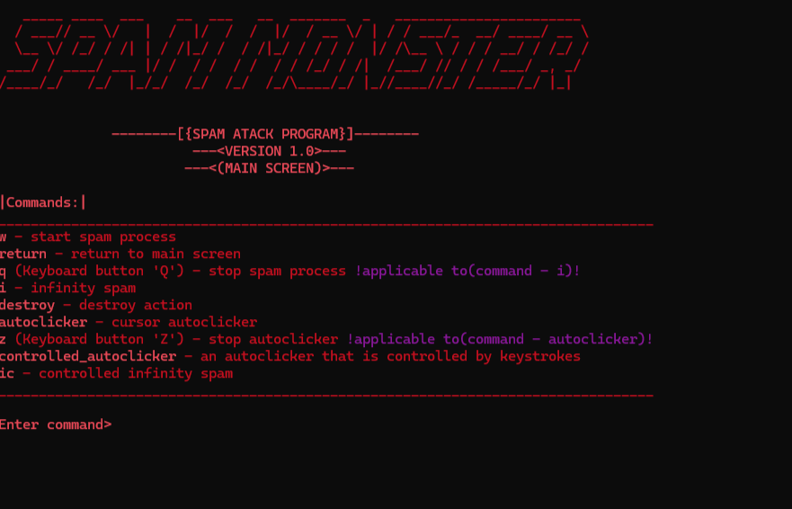

# Spam-program
Spam program using pyautogui library

A console application for spam.

<h2>Commands:</h2>

<b>w</b> - spamming a given text with a certain set amount
 
<b>return</b> - return to main screen
 
<b>q (keybord button)</b> - stop spam (applicable to command 'i')
 
<b>i</b> - infinity spam
 
<b>destroy</b> - destroy selected action
 
<b>autoclicker</b> - cursor autoclicker
 
<b>z (keyboard button)</b> - stop autoclicker (applicable to command 'autoclicker')
 
<b>controlled_autoclicker</b> - an autoclicker that is controlled by keystrokes
 
<b>ic</b> - controlled infinity spam

<h1>Requirements:</h1>

##
    pip install pyfiglet

##
    pip install pyautogui

##
    pip install colorama

##
    pip install keyboard
